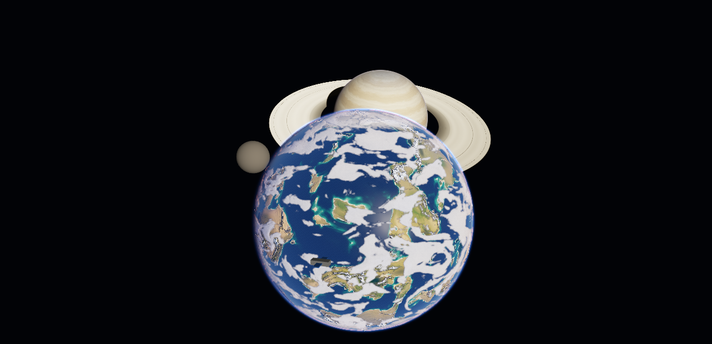

# procedural-planets

Procedural planets, gas giants and stars for **three.js**, created from code
and dropped into your own scene.

- **Terrestrial planets.** GPU height field on a cube-sphere quadtree LOD, climate biomes, an analytic ocean (Beer–Lambert water, sun glint, foam), volumetric clouds and physically based atmospheric scattering.
- **Gas giants.** Belts, zones and jets, storms and a great spot, rings with shadows.
- **Stars.** Blackbody colour, granulation, sunspots, prominences, a corona and bloom.
- **Two ways to use them.** Live full-quality planets composited into your frame with correct depth, or cheap baked meshes with standard materials.

This repository also contains **Procedural Planets Studio**, the visual editor
used to design planets. Anything made there can be loaded back in code (see
[studio interop](docs/studio-interop.md)).

<p align="center"></p>

## Install

```sh
npm install procedural-planets three
```

The package requires **WebGL2** and **three.js ≥ 0.160** (a peer dependency).
It is ESM-only and ships TypeScript declarations. For type checking, also
install `@types/three`.

## Quick start: a planet inside your scene

```js
import * as THREE from 'three';
import { Planet, PlanetRenderer } from 'procedural-planets';

const renderer = new THREE.WebGLRenderer({ antialias: true });
const scene = new THREE.Scene();
const camera = new THREE.PerspectiveCamera(50, innerWidth / innerHeight, 1, 1e6);
camera.position.set(0, 1500, 6000);

// Planets are Object3Ds: add them, move them, parent them.
const sun = new Planet({ type: 'star', preset: 'sun', radius: 2500 });
sun.position.set(90000, 14000, 40000);
const earth = new Planet({ preset: 'terran', seed: 42, lightSource: sun });
const giant = new Planet({ preset: 'ringed', radius: 4500, lightSource: sun });
giant.position.set(-16000, 1800, -24000);
scene.add(sun, earth, giant);

const planets = new PlanetRenderer(renderer);   // one per WebGLRenderer

renderer.setAnimationLoop(() => {
  renderer.render(scene, camera);   // your scene first...
  planets.render(scene, camera);    // ...then the planets, depth-tested against it
});

// change anything live
earth.set({ seaLevel: 0.55, cloudCoverage: 0.6, atmoColor: '#6fa8ff' });
```

## Quick start: a self-contained viewer

```js
import { PlanetViewer } from 'procedural-planets';

const viewer = new PlanetViewer({
  container: document.getElementById('planet'),
  planet: { preset: 'desert', seed: 7 },
});
viewer.planet.set({ tempBias: 0.9 });
```

## Quick start: baked, cheap, static

```js
import { bakePlanet } from 'procedural-planets';

const moon = await bakePlanet(renderer, { preset: 'moon', radius: 500, textureSize: 1024 });
scene.add(moon);   // plain meshes with MeshStandardMaterial, lit by your lights
```

## Documentation

| | |
|---|---|
| [Getting started](docs/getting-started.md) | Install, the three usage tiers, first scene |
| [Embedding guide](docs/embedding.md) | Render order, depth, tone mapping, scale, multiple planets, EffectComposer, LOD, performance |
| [API reference](docs/api.md) | `Planet`, `PlanetRenderer`, `PlanetViewer`, `bakePlanet`, `PlanetPass`, export helpers |
| [Parameters](docs/parameters.md) | Every parameter: type, default, range, meaning |
| [Presets](docs/presets.md) | The built-in looks |
| [Baking and export](docs/baking.md) | `bakePlanet`, glTF / ZIP export |
| [Studio interop](docs/studio-interop.md) | Load studio projects and exports in code |
| [Examples](examples/) | Runnable pages: `npm run dev`, then open `/examples/` |

## Working on this repository

```sh
npm install
npm run dev          # studio at http://localhost:6061/, examples at /examples/
npm test             # unit tests (vitest)
npm run build:lib    # library -> dist/lib
npm run build:studio # studio app -> dist/studio
npm run docs:params  # regenerate docs/parameters.md, docs/presets.md, PARAM_DOCS, types/params.d.ts
```

Visual checks (with `npm run dev` running):

- `/test/visual/studio-shots.html`: fixed-camera studio frames, to diff before and after engine changes.
- `/test/visual/embed-checks.html?case=origin|far|logdepth|lod|inside|target`: the embedding edge cases.

Layout:

```
src/engine/   the engine (Planet, PlanetRenderer, PlanetViewer, pipeline, shaders, baker)
src/lib/      the package entry points (index.js, export.js) + PlanetPass
src/          the studio app (React)
types/        TypeScript declarations (params.d.ts is generated)
docs/         documentation (parameters.md / presets.md are generated)
examples/     runnable examples
```

## License

MIT, see [LICENSE](LICENSE).
