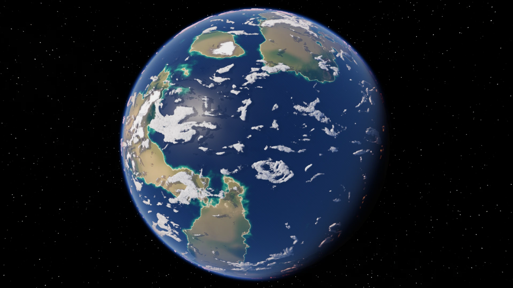
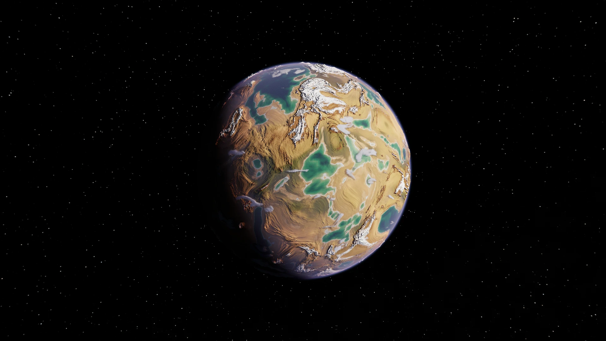
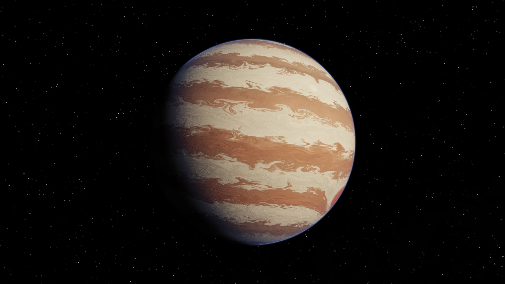
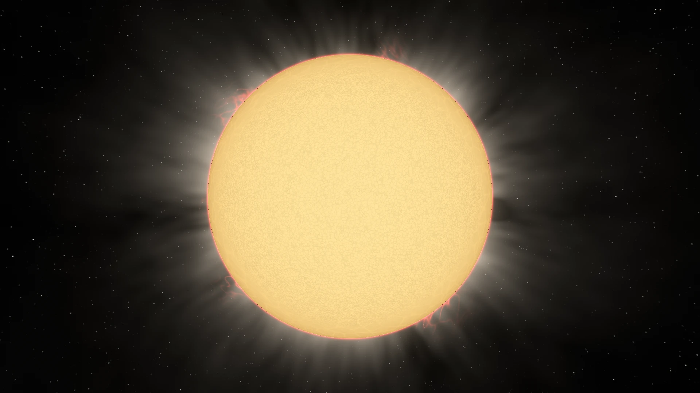
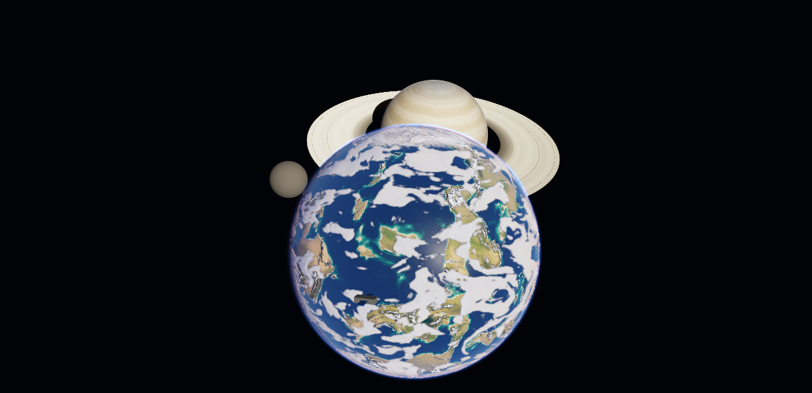
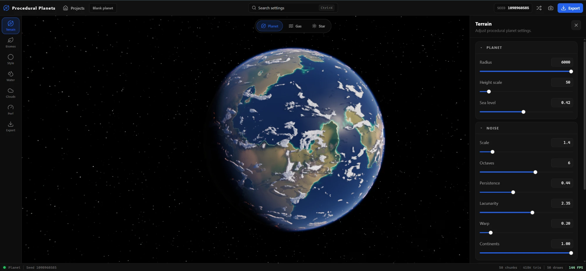

# procedural-planets

Procedural planets, gas giants and stars for **three.js**, created from code
and dropped into your own scene.

<p align="center"></p>

- **Terrestrial planets.** GPU height field on a cube-sphere quadtree LOD, climate biomes, an analytic ocean (Beer–Lambert water, sun glint, foam), volumetric clouds and physically based atmospheric scattering.
- **Gas giants.** Belts, zones and jets, storms and a great spot, rings with shadows.
- **Stars.** Blackbody colour, granulation, sunspots, prominences, a corona and bloom.
- **Two ways to use them.** Live full-quality planets composited into your frame with correct depth, or cheap baked meshes with standard materials.
- **Deterministic.** The same seed and parameters always give the same body, so a planet is just a small parameter object you can save, share or generate.

This repository also contains **Procedural Planets Studio**, the visual editor
used to design planets. Anything made there can be loaded back in code (see
[below](#procedural-planets-studio) and [studio interop](docs/studio-interop.md)).

## Gallery

<table>
  <tr>
    <td width="50%"></td>
    <td width="50%"></td>
  </tr>
  <tr>
    <td align="center"><sub>Terrestrial: an arid world with shallow seas and snow-capped ranges</sub></td>
    <td align="center"><sub>Gas giant: belts, zones, jet-stream turbulence and a great spot</sub></td>
  </tr>
  <tr>
    <td width="50%"></td>
    <td width="50%"></td>
  </tr>
  <tr>
    <td align="center"><sub>Star: granulation, prominences and corona</sub></td>
    <td align="center"><sub>Embedded next to ordinary three.js meshes (<a href="examples/embed-solar-system.html">examples/embed-solar-system.html</a>)</sub></td>
  </tr>
</table>

## Install

```sh
npm install procedural-planets three
```

The package requires **WebGL2** and **three.js ≥ 0.160** (a peer dependency).
It is ESM-only and ships TypeScript declarations. For type checking, also
install `@types/three`.

## Quick start: a planet inside your scene

```js
import * as THREE from 'three';
import { Planet, PlanetRenderer } from 'procedural-planets';

const renderer = new THREE.WebGLRenderer({ antialias: true });
const scene = new THREE.Scene();
const camera = new THREE.PerspectiveCamera(50, innerWidth / innerHeight, 1, 1e6);
camera.position.set(0, 1500, 6000);

// Planets are Object3Ds: add them, move them, parent them.
const sun = new Planet({ type: 'star', preset: 'sun', radius: 2500 });
sun.position.set(90000, 14000, 40000);
const earth = new Planet({ preset: 'terran', seed: 42, lightSource: sun });
const giant = new Planet({ preset: 'ringed', radius: 4500, lightSource: sun });
giant.position.set(-16000, 1800, -24000);
scene.add(sun, earth, giant);

const planets = new PlanetRenderer(renderer);   // one per WebGLRenderer

renderer.setAnimationLoop(() => {
  renderer.render(scene, camera);   // your scene first...
  planets.render(scene, camera);    // ...then the planets, depth-tested against it
});

// change anything live
earth.set({ seaLevel: 0.55, cloudCoverage: 0.6, atmoColor: '#6fa8ff' });
```

## Quick start: a self-contained viewer

```js
import { PlanetViewer } from 'procedural-planets';

const viewer = new PlanetViewer({
  container: document.getElementById('planet'),
  planet: { preset: 'desert', seed: 7 },
});
viewer.planet.set({ tempBias: 0.9 });
```

## Quick start: baked, cheap, static

```js
import { bakePlanet } from 'procedural-planets';

const moon = await bakePlanet(renderer, { preset: 'moon', radius: 500, textureSize: 1024 });
scene.add(moon);   // plain meshes with MeshStandardMaterial, lit by your lights
```

## Procedural Planets Studio

<p align="center"></p>

The studio is a browser editor built on the same engine as the package. Switch
between planet, gas giant and star; tune terrain, biomes, style, water, clouds
and performance settings with live feedback; search every setting with
<kbd>Ctrl</kbd>+<kbd>K</kbd>; save projects; and export glTF / ZIP or a
ready-to-paste code snippet from the **Export** panel's *Use in code* section.

The header's **File / Edit / View** menus cover the project workflow: rename,
save (<kbd>Ctrl</kbd>+<kbd>S</kbd>), save as, load and download `.ppplanet`
files, copy the code snippet, undo / redo, random seed, reset camera and
auto rotate.

Run it locally with `npm run dev` and open <http://localhost:7071/>. To load a
studio project or export in your own code, see
[studio interop](docs/studio-interop.md).

### Accounts, cloud projects and community

Accounts are optional: projects are always saved in the browser first. With an
account, the **Projects** page syncs planets to a cloud library (conflicts are
detected, never overwritten), each cloud planet can be private, unlisted or
public, and public planets appear on the **Community** page, where anyone can
open a copy or copy its `procedural-planets` code. Administrators get a
dashboard with users, visits, planets, security events and an audit log.

The account service lives in [`api/`](api/README.md): Node.js 22, Fastify and
MySQL / MariaDB, on port 7070. Vite proxies `/api` to it during development.

For production on a VPS with GitHub Actions, see the
[deployment guide](docs/deployment.md) (GitHub secrets, SSH, PM2 and Pangolin routing).

```sh
cp api/.env.example api/.env   # set DB_PASSWORD, ADMIN_EMAILS, ...
npm --prefix api install
npm run migrate:api            # creates the procedural_planets schema
npm run dev                    # studio on http://localhost:7071 + API on :7070
```

`npm run dev` starts both processes (output prefixed `[web]` / `[api]`); use
`npm run dev:web` or `npm run dev:api` to run only one. If the API cannot start
(no database), the studio keeps running in local-only mode.

## Infinite exploration

Open **Explore** on the studio home page, or **View → Explore infinite worlds**
while editing, to visit the real-scale Solar System (eight planets, Pluto and
24 selected moons) and deterministic procedural systems beyond it.
Use WASD or ZQSD and the mouse, the wheel or speed slider, and targeted approach
for astronomical travel. Saved render settings and photo mode provide quality
controls and PNG capture. Returning resumes your unchanged editor. The mode
uses the package's `Planet` and `PlanetRenderer`, with bounded streaming,
floating coordinates and existing terrain/impostor LOD. See the
[exploration guide](docs/exploration.md) for controls, architecture and checks.

## Documentation

| | |
|---|---|
| [Getting started](docs/getting-started.md) | Install, the three usage tiers, first scene |
| [Embedding guide](docs/embedding.md) | Render order, depth, tone mapping, scale, multiple planets, EffectComposer, LOD, performance |
| [API reference](docs/api.md) | `Planet`, `PlanetRenderer`, `PlanetViewer`, `bakePlanet`, `PlanetPass`, export helpers |
| [Parameters](docs/parameters.md) | Every parameter: type, default, range, meaning |
| [Presets](docs/presets.md) | The built-in looks |
| [Baking and export](docs/baking.md) | `bakePlanet`, glTF / ZIP export |
| [Studio interop](docs/studio-interop.md) | Load studio projects and exports in code |
| [Examples](examples/) | Runnable pages: `npm run dev`, then open `/examples/` |

## Working on this repository

```sh
npm install
npm run dev          # studio at http://localhost:7071/ + account API at :7070, examples at /examples/
npm run dev:web      # the studio alone (no account API)
npm test             # unit tests (vitest)
npm run test:api     # API unit tests (node:test)
npm run build:lib    # library -> dist/lib
npm run build:studio # studio app -> dist/studio
npm run docs:params  # regenerate docs/parameters.md, docs/presets.md, PARAM_DOCS, types/params.d.ts
npm run bench        # performance + quality harness (see bench/README.md)
```

Visual checks (with `npm run dev` running):

- `/test/visual/studio-shots.html`: fixed-camera studio frames, to diff before and after engine changes.
- `/test/visual/embed-checks.html?case=origin|far|logdepth|lod|inside|target`: the embedding edge cases.

Layout:

```
src/engine/   the engine (Planet, PlanetRenderer, PlanetViewer, pipeline, shaders, baker)
src/lib/      the package entry points (index.js, export.js) + PlanetPass
src/          the studio app (React)
api/          the account / cloud project / admin service (Fastify + MySQL)
types/        TypeScript declarations (params.d.ts is generated)
docs/         documentation (parameters.md / presets.md are generated)
examples/     runnable examples
bench/        the benchmark harness (headless Chrome on the real GPU)
```

## License

MIT, see [LICENSE](LICENSE).
